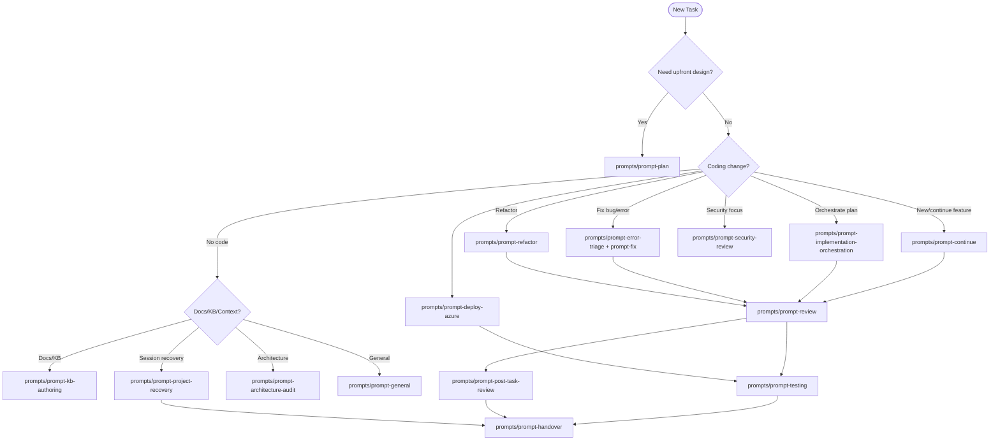
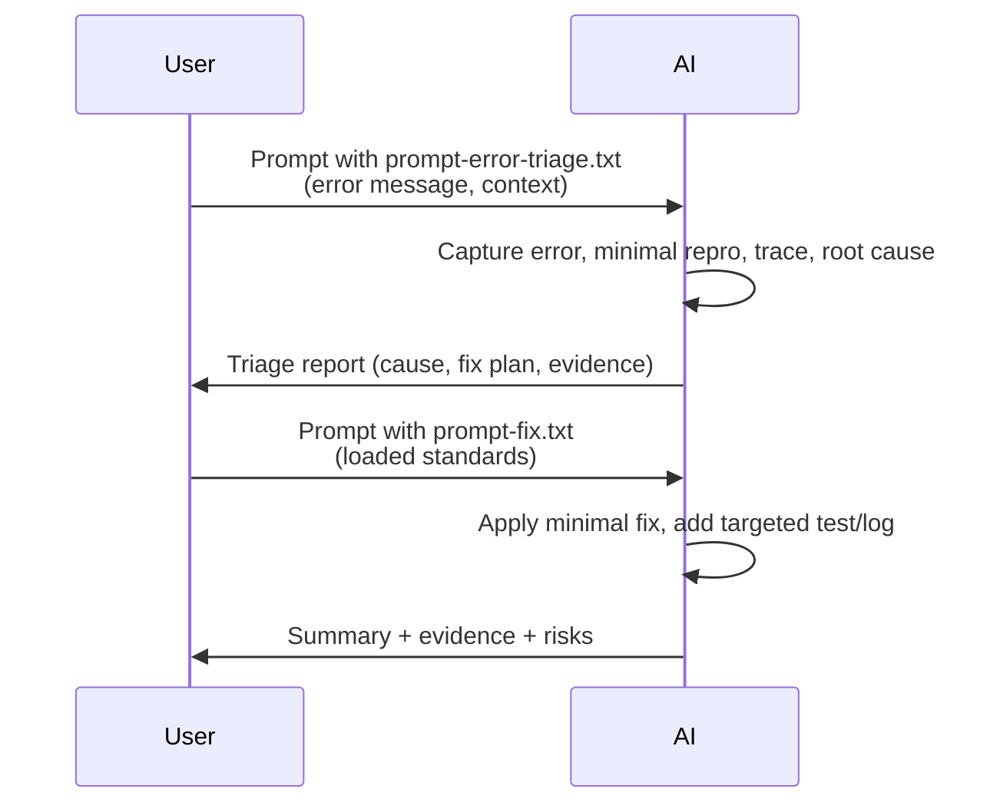
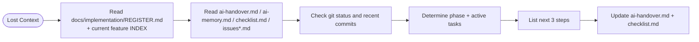
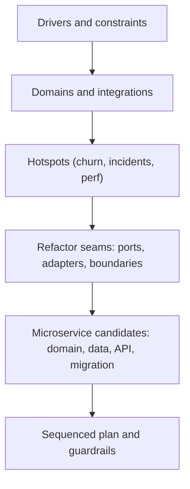

# Prompt Usage Guide

Visual guide to pick the right prompt, load the right standards, and understand expected AI responses.

## Quick Selection Map

## Bundle Cheat Sheet (see `postfix.md` for details)
- **Always**: `00-core-behavior.md`.
- **UI/Visual**: `01-brand-kit.md` + `02-modality-rules.md` (+`03-quality-guardrails.md` when shipping).
- **Backend/API/CLI/Docs**: `02-modality-rules.md` + `03-quality-guardrails.md` + `07-code-quality.md`; add `04-testing-standards.md` for validation; add `05-security-standards.md` when auth/data sensitive.
- **Planning/Architecture**: `02-modality-rules.md` + `03-quality-guardrails.md` + `06-development-workflow.md` + `10-ai-context-guide.md`; add `07-code-quality.md` for depth; add `05-security-standards.md` when boundaries matter.
- **Implementation/Refactor/Fix**: `02-modality-rules.md` + `03-quality-guardrails.md` + `04-testing-standards.md` + `06-development-workflow.md` + `07-code-quality.md`; add `05-security-standards.md` for sensitive areas; add `01-brand-kit.md` for UI.
- **Recovery/Handover**: `06-development-workflow.md` + `10-ai-context-guide.md` + feature docs under `docs/implementation/current/`.

## Flow Examples

### Bug/Error Fix

### Project Recovery After Interruption

### Architecture / Microservice Audit

## Expected Response Styles
- **prompt-review.txt:** Findings first, ordered by severity, each with `file:line`, impact, and fix/test suggestion. Short next steps.
- **prompt-fix.txt:** Root cause, smallest fix, evidence from tests/logs, residual risks.
- **prompt-project-recovery.txt:** Session summary with phase, last actions (evidence), uncommitted work, blockers, next 3 steps, confidence.
- **prompt-general.txt:** Restate -> light plan -> execute in small steps -> validate -> summarize with evidence and next actions.

## Knowledge and State Updates
- Search KBs before writing; update the correct KB entry with evidence when new durable knowledge is produced (`C:\GitHub\LearnSD\GeneralKB\KB_GOVERNANCE.md`).
- Keep `ai-memory.md` for persistent context and `ai-handover.md` for session transitions.
- Persist MCP state under `.mcp-state/` per feature when using MCP tools (see `06-development-workflow.md` and `10-ai-context-guide.md`).
